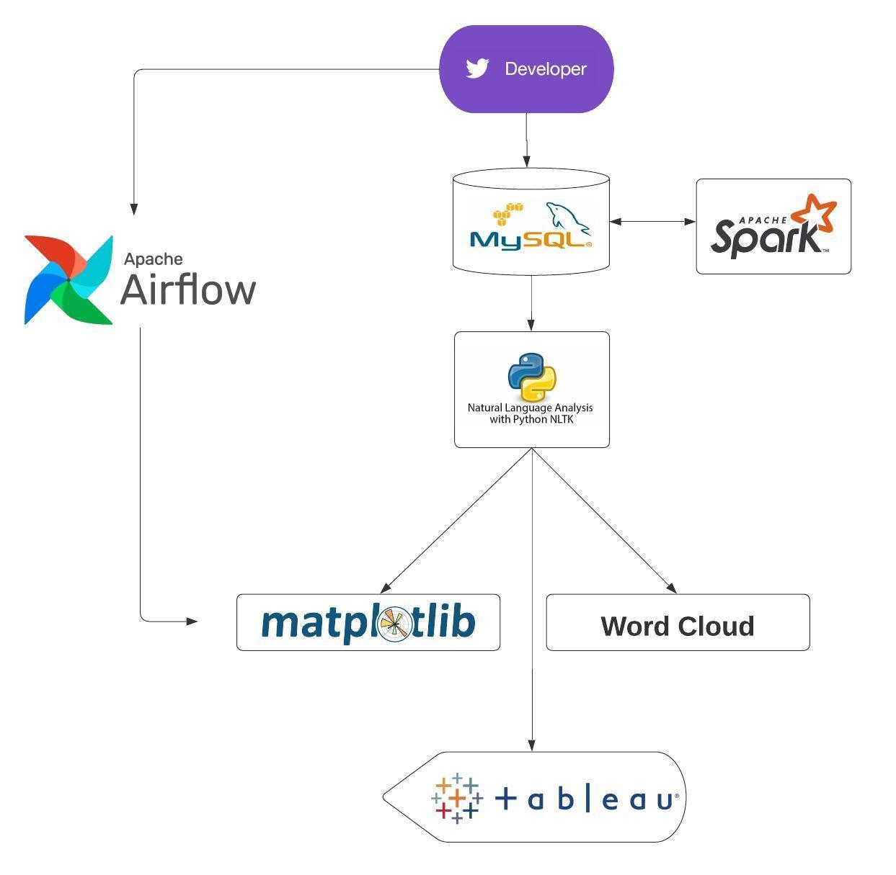
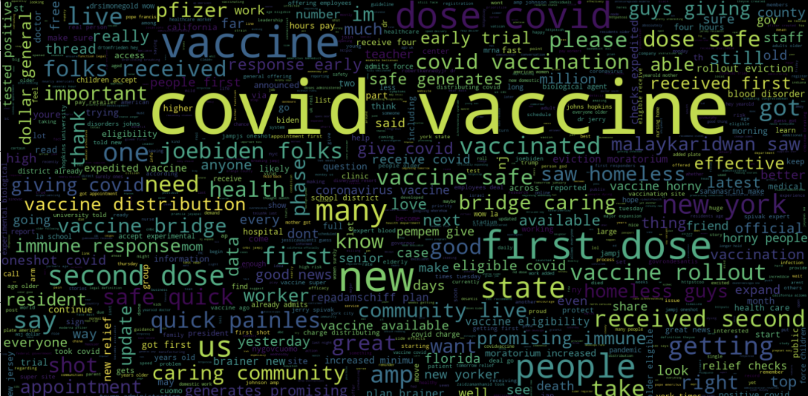
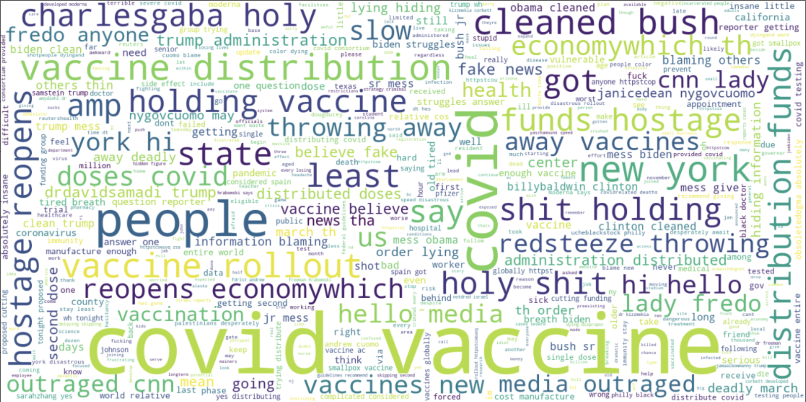

# Sentiment Analysis of Conversation Surrounding Covid-19 Vaccine 

***

For our final project at Zip Code Wilmington, we chose to create a sentiment analyis on the Twitter conversation surrounding the COVID-19 vaccine in the United States. We produced streams of all the tweets using the Twitter API and put the data into an AWS SQL database. We then cleaned the data with Spark and returned it to the database.

After acquiring this data, we used NLTK machine learning models to analyze the sentiment of the tweets. We then separated the tweets into four different tables, based on what region of the United States they came from and created various visualizations of the data using Wordcloud and [Matplotlib](https://github.com/Anujangalapalli/ZCW-FinalProject/blob/main/Images/stackedbar-matplotlib.png). The whole process was automated using an [Apache Airflow DAG](https://github.com/Anujangalapalli/ZCW-FinalProject/blob/main/Images/dag.png).

Lastly, we made an [interactive data visualizations using Tableau](https://public.tableau.com/profile/lee.givhan#!/vizhome/USASentimentViz1/Dashboard1?publish=yes) where you can view the sentiment analysis for the USA and isolate each region.

Here is a flowchart showing how all of the technologies worked together:

---  

In the sentiment analysis, tweets were split into three categories: positive, negative and neutral. Using Word Cloud, we generated images of the key words for each category. The larger the word, the more common it was.

Here are the words found in **positive** tweets. 

Here are key words found in **negative** tweets:

### API Used  

- [Twitter's Streaming API](https://developer.twitter.com/en/docs/tutorials/consuming-streaming-data)
 
### Frameworks Used  

- Airflow
- AWS lightsail MySql
- PANDAS 
- Matplotlib
- Tableau
- NLTK
- Papermill
- PySpark

## Meet the Team
---
### Anusha Jangalapalli
[Connect on LinkedIn](https://www.linkedin.com/in/anushajangalapalli/)   
  
### Lee Givhan  
[Connect on LinkedIn](https://www.linkedin.com/in/leegivhan/) 

### Sumalatha Konjeti
[Connect on LinkedIn](https://www.linkedin.com/in/sumalatha-konjeti/)
